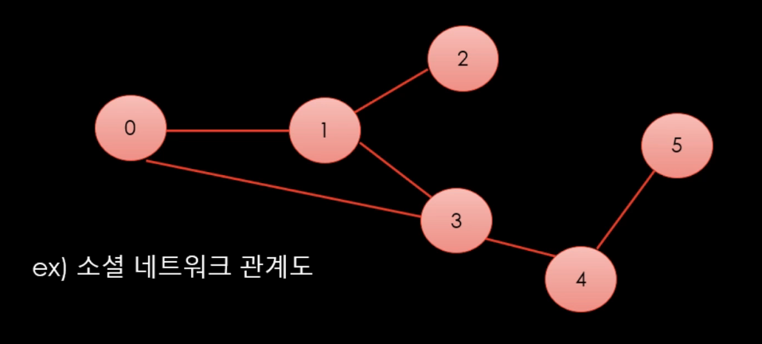

# Graph

현실세계의 사물이나 추상적인 개념간의 연결관계를 표현


- 정점(Vertex) : 데이터를 표현(사물, 개념 등)
- 간선(Edge) : 정점들을 연결하는데 사용

### 그래프 예시



### 가중치 그래프(Weighted Graph)


- 엣지 위에 수치를 추가할 수 있음
  - 지하철 노선도라고 하면 역 사이의 물리적 거리나 소요시간 등의 정보일 수 있음
  - 이를 활용하면 역 사이의 최단거리를 구할 수 있다

### 방향 그래프(Directed Graph)


- 0에서 1로 가는 엣지와 1에서 0으로 가는 엣지는 다름
- 일방 통행이 포함된 도로망
- 두사람 사이의 호감도

## 그래프의 표현

### 인스턴스 생성


LinkedList의 Node처럼 인스턴스를 생성한다.

```csharp
class Vertex
{
    public List<Vertex> edges = new List<Vertex>();
}

class Program
{
    void CreateGraph()
    {
        List<Vertex> v = new List<Vertex>(5)
        {
            new Vertex(),
            new Vertex(),
            new Vertex(),
            new Vertex(),
            new Vertex()
        };

        v[0].edges.Add(v[1]);
        v[0].edges.Add(v[3]);
        v[1].edges.Add(v[0]);
        v[1].edges.Add(v[2]);
        v[1].edges.Add(v[3]);
        // ...이런식으로 edges 연결
    }
}
```

- 매번 new Vertex()로 정점을 하나씩 만들어야 하는 단점이 있다
- 대안으로 List를 이용하는 방법이 있음

### 리스트를 이용하기

Vertex 인스턴스 생성 부담을 줄이기 위해 리스트를 사용한다.


```csharp
// 읽는 방법 : adjacent[from] -> 연결된 목록
// 리스트를 이용한 그래프 표현
// 메모리는 아낄 수 있지만, 접근 속도에서 손해를 본다
// 간선이 적고 정점이 많은 경우 이점이 있다

List<int>[] adjacent = new List<int>[6]
{
    new List<int> {1,3},
    new List<int> {0,2,3},
    new List<int> {},
    // .. 이런식으로 각 정점에 연결된 점들을 리스트로 표현
}
```

#### 🙊 가중치가 있는 경우


```csharp
class Edge
{
    int _vertex;
    int _weight;
    public Edge(int v, int w)
    {
        _vertext = v;
        _weight = w;
    }
}

List<Edge> adjacent = new List<Edge>[6]
{
    new List<Edge>() { new Edge(1,15), new Edge(3, 35)},
    new List<Edge>() { new Edge(0,15), new Edge(2, 5), new Edge(3,10)},
    // .. 이런식으로 구현
}
```

- 리스트를 순회하면서 원하는 값이 있는지 찾아야 하기 때문에 접근 속도에서 손해를 본다

### 행렬(2차원 배열)을 이용하기


접근 속도를 높이기 위해 행렬을 사용할 수 있다.

- 메모리 소모가 심하지만 빠른 접근이 가능하다
- 정점은 적고 간선이 많은 경우 이점이 있다.

#### 🙊 가중치가 있는 경우

가중치를 그대로 배열에 넣어준다
연결이 안되어 있는 경우 가중치 중에 안쓰는 숫자(ex> -1)로 표현


