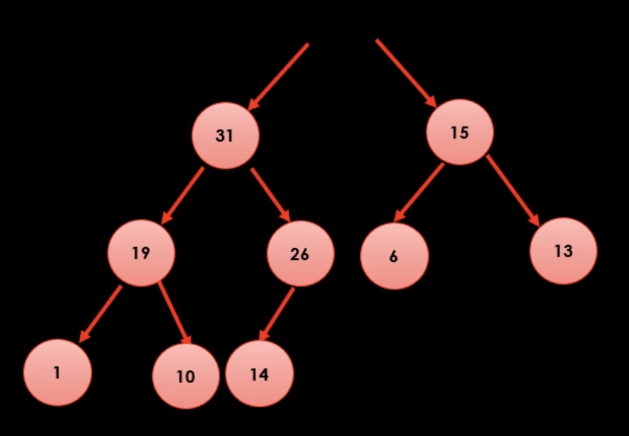

# 힙 이론

### 이진 트리의 개념

각 노드가 최대 두개의 자식 노드를 가짐

### 이진 검색 트리 특징

- 왼쪽을 타고 가면 현재 값보다 작다
- 오른쪽을 타고 가면 현재 값보다 크다
- 어떤 값을 찾을때 굉장히 빨리 찾을 수 있음
  

ex) 31을 찾는다고 하면 16을 기준으로 16보다 크니까 오른쪽, 78을 기준으로 78보다 31이 작으니까 왼쪽으로 찾아 간다

### 이진 검색 트리 문제

그냥 무식하게 노드를 추가하면 한쪽으로 기울어져서 트리의 균형이 꺠진다. 빠르게 값을 찾을 수 있는 이점이 사라지고 리스트 탐색과 비슷해진다.    
트리 재배치를 통해 균형을 유지하는 것이 과제(AVL, Red-Black)

### 힙 트리 특징

- 힙 트리 1법칙 : 부모 노드가 가진 값은 항상 자식 노드가 가진 값보다 크다
- 힙 트리 2법칙 : 노드 개수를 알면 트리 구조는 무조건 확정할 수 있다
- 마지막 레벨을 제외한 모든 레벨에 노드가 꽉 차 있다
- 마지막 레벨에 노드가 있을 떄는, 항상 왼쪽부터 순서대로 채워야 한다

배열을 이용해서 힙 구조를 바로 표현할 수 있다

- i번 노드의 왼쪽 자식은 [(2*i) + 1] 번
- i번 노드의 오른쪽 자식은 [(2*i) + 2] 번
- i번 노드의 부모는 [(i-1) / 2] (나머지 버림)

### 힙 트리에 새로운 값 추가

31이라는 값을 추가해보자

힙 트리 2법칙에 의해 트리 구조부터 맞춰 준다. 10 다음에 31이 위치해야 한다. 그 다음 힙 트리 1법칙에 의해 자식 노드가 부모 노드보다 크다면 위치를 바꿔준다.

14와 31을 비교하면 31이 크므로 서로 위치를 바꿔준다.

26과 31을 비교하면 31이 더 크므로 서로 위치를 바꿔준다. 32는 31보다 크므로 더이상 위치를 바꾸지 않는다. 

### 최대값 꺼내기

힙 트리의 특성상 최대값은 무조건 루트 노드에 있는 값이다.

최대값을 먼저 제거한다. 힙 트리 2법칙에 의해 노드 개수를 알면 트리구조는 확정할 수 있다. 우선 제일 마지막에 위치한 데이터를 루트로 옯긴다.

힙 트리 1법칙을 지켜야 하므로 아래로 내려가면서 부모 노드와 자식노드의 값을 비교한다(역 도장꺠기?)

14는 31보다 작으므로 위치를 바꾼다.

14는 19, 26보다 작은데 26이 더 크므로 26과 14의 위치를 바꾼다.

